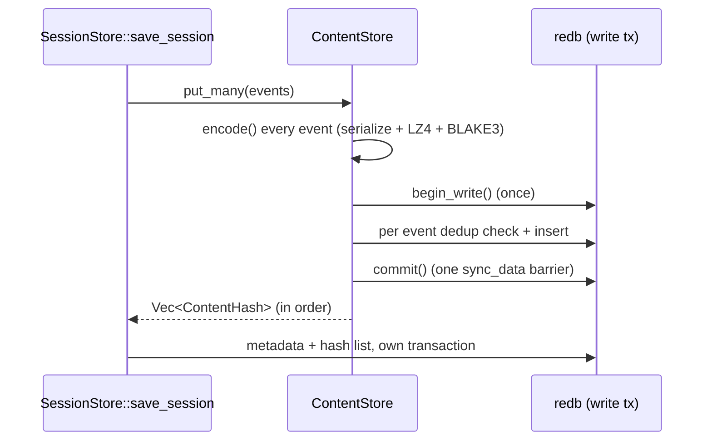

# Verify Report — m9-74-cas-put-many-batching

| Campo | Valor |
|---|---|
| Cycle | `m9-74-cas-put-many-batching` |
| Path | B-direct |
| Base SHA | `6317af899440178d30dc1d45807aed1851d0bb83` |
| Head SHA (pre-artifacts) | `ac539db3014eeefcb165559d7629102c2205e605` |
| Diff digest | `sha256:09bc638f7663be593bc21a0d00642e80adef50700e73ff857cf657fdf46f69a7` |
| Verified at | `2026-09-13T16:48Z` |
| Working tree | clean at verification time; artifact writes follow |
| Verdict | **passed** |

## Summary

Verdict: **passed**. Three findings closed: the high one m9-73 deferred
(`FIND-M9-73-CAS-PUT-ONE-WRITE-TRANSACTION-PER-EVENT`), its visible symptom
(`FIND-M9-73-SESSION-EDGE-CASES-HEAVY-SAVE-NEVER-COMPLETES`), and a new medium
one found while validating the first two
(`FIND-M9-74-V1-SHIMS-RETURN-V2-ENVELOPE`).

The second fix is the interesting part of this cycle. m9-73 left two
`session_edge_cases` tests red on `main` and attributed the failure to the
per-event CAS commit, correctly. Fixing that removed the timeout and revealed
what was hiding behind it: both tests then failed with
`missing field 'session_a_id'`, because m7-03 rerouted the deprecated v1 tools
through the v2 dispatcher and silently changed their response shape. Nobody
could see it while the save never completed. The two defects are independent,
and the acceptance evidence for the first one is only meaningful once the
second one is fixed, since the suite has to reach the comparison step to
exercise it.

## Subject

- base_sha: `6317af899440178d30dc1d45807aed1851d0bb83` (`main` at cycle start)
- head_sha: `ac539db3014eeefcb165559d7629102c2205e605` (pre-artifacts source commit)
- diff_digest: `sha256:09bc638f7663be593bc21a0d00642e80adef50700e73ff857cf657fdf46f69a7`
- working_tree_clean: true (at verification time)
- verified_at: `2026-09-13T16:48Z`
- cwd: `/var/mnt/DiscoChino2-fast/Proyectos/rust/chronos`
- route: B-direct (skill → apply → light-verify → release → archive)
- commits under test: `bc3b912` (store), `e3fa0fc` (mcp), `ac539db` (docs)

## Closed findings

### FIND-M9-73-CAS-PUT-ONE-WRITE-TRANSACTION-PER-EVENT (high, `perf.transaction_per_item`)

`ContentStore::put` opened a redb write transaction, inserted one row, and
committed. redb defaults to immediate durability and `set_durability` appears
nowhere in `chronos-store`, so every `commit()` is a `sync_data` barrier, and
`SessionStore::save_session` called `put` in a loop: one fsync per event.
m9-73 measured the consequence — a 34,905-event crash session did not complete
in 186 s (linear at ≈4.8 ms/event), against the sandbox client's 30 s
`tools/call` timeout — and proposed `put_many`. The shape of the fix:

| Piece | Role |
|---|---|
| `ContentStore::encode(event) -> (ContentHash, Vec<u8>)` | the pure serialize + LZ4 + BLAKE3 step, split out so a batch is encoded *before* a transaction opens; an encoding failure therefore stores nothing |
| `ContentStore::insert_batch(&[(hash, bytes)])` | one write transaction, per-event dedup check preserved, one `commit()` |
| `ContentStore::put_many(&[TraceEvent]) -> Vec<ContentHash>` | one hash per event in input order; empty batch returns without touching the database |
| `ContentStore::put` | now `encode` + `insert_batch`; same behaviour, same hash |
| `SessionStore::save_session` | CAS side via `put_many`, so one transaction for all events plus one for metadata |

Deduplication is unchanged in kind: a redb write transaction reads its own
inserts, so duplicates *inside* a batch collapse exactly like duplicates
against the existing store, and both are asserted.

### FIND-M9-73-SESSION-EDGE-CASES-HEAVY-SAVE-NEVER-COMPLETES (medium, `test.environmental_failure`)

The observable symptom of the finding above, recorded separately by m9-73
because it could not then be proven to be the same defect. It is: with
`put_many` in place both tests pass, and the suite goes from
`4 passed / 2 failed, 186 s+ (never completes)` to `6 passed / 0 failed, 65 s`
with the client timeout untouched at 30 s. The row was removed from
`AGENTS.md` §6.5 rather than reworded, with a note recording where it went.

### FIND-M9-74-V1-SHIMS-RETURN-V2-ENVELOPE (medium, `api.deprecated_shim_shape_drift`)

Found by running the acceptance suite once the first finding was fixed. Both
`session_edge_cases` comparison tests failed with
`compare_sessions failed: RpcError("missing field 'session_a_id'")` and
`performance_regression_audit failed: ...`.

m7-03 (`947e73b`) converted the two v1 tools into shims that route through
`dispatch_session_compare` and, with that, changed what they return:

| | Before m7-03 | m7-03 and after (pre-m9-74) | m9-74 |
|---|---|---|---|
| `compare_sessions` response | flat `{session_a_id, …, summary}` (hand-built `json!` in the tool body) | `{kind:"divergence", result:{…}, provenance:{…}}` | flat again |
| `performance_regression_audit` response | flat `{baseline_session_id, …, summary}` | `{kind:"regression", result:{…}, provenance:{…}}` | flat again |
| `session_compare` response | n/a | envelope | envelope (unchanged) |

The tools kept their v1 names, their v1 parameters and their "DEPRECATED v1
shim … the v1 parameter names are preserved" descriptions, and
`SessionCompareOutput`'s own doc comment states the intent: "MCP shims drop the
`provenance` field so existing v1 callers see the same JSON they did before
m7-03". The flat shape is therefore the declared contract. Nothing pinned it:
the four `chronos-mcp` tests for these tools assert only on the `Debug` text of
the content (`"similarity_pct"`, `"common_count"`), which the nested shape also
satisfies, and the sandbox client — a v1 client — is the only caller that
parses it as JSON.

Fix: new `SessionCompareWire { V2Envelope, V1Flat }` selects the response
shape, the dispatcher takes it as a parameter, `session_compare` passes
`V2Envelope`, and both shims pass `V1Flat` (serializing the flat
`CompareSessionsResult` / `PerformanceRegressionAuditResult` the services
crate kept for exactly this purpose). Their descriptions now state the
response shape as well as the parameter names. The class is closed: those are
the only two tools in `chronos-mcp` whose description contains "DEPRECATED v1
shim", verified by grep.

## Files Inventory

| File | Change |
|---|---|
| `crates/chronos-store/src/cas.rs` | +210/−23: `encode`, `insert_batch`, `put_many`; `put` refactored onto them; 4 tests |
| `crates/chronos-store/src/storage.rs` | +65/−7: `save_session` uses `put_many` (doc note on CAS-then-metadata ordering); 1 test asserting the barrier count |
| `crates/chronos-store/src/lib.rs` | +2: `mod test_support` under `#[cfg(test)]` |
| `crates/chronos-store/src/test_support.rs` | new, 70 lines: `CountingBackend` (wraps redb's real `FileBackend`, counts `sync_data`) + `counting_file_db` |
| `crates/chronos-mcp/src/server.rs` | +173/−8: `SessionCompareWire` + dispatcher parameter + both shims `V1Flat` + descriptions; new shape test |
| `AGENTS.md` | +16/−3: §6.5 `chronos-native` row rewritten with the measured parallel behaviour, the two `session_edge_cases` rows removed (fixed here), T3 two-halves recipe |

Data-flow of the fix (CAS write path):

## Falsification evidence

Four observations. Every revert was applied, observed, and restored; both
restored files were compared byte-for-byte with their pre-falsification copies
(`cmp`, byte-identical) before the green run below.

| # | Configuration | Observed result |
|---|---|---|
| 1 | `put_many` reverted to the per-event `put` loop (`cas.rs` restored from `/home/rubentxu/.jcode/scratch/cas.rs.m9-74-good`) | `test_put_many_commits_once_per_batch` **FAILED** — a 500-event batch issued 500+ `sync_data` barriers against the `CountingBackend`, and the control loop's 50 `put` calls issued ≥50; restored byte-identical, `cargo test -p chronos-store --lib` 74 passed |
| 2 | Both shims reverted to `SessionCompareWire::V2Envelope` | `test_v1_shims_return_flat_result_while_v2_returns_envelope` **FAILED** at `assert_eq!(v["session_a_id"], json!(sid_a))` — the v1 client sees `null` where the contract says a string; restored byte-identical (`cmp`), `cargo test -p chronos-mcp --lib` 78 passed |
| 3 | The acceptance suite, before fix #2 and with fix #1 in place | `session_edge_cases` reaches the comparison step for the first time ("Saved target: 1703 events") and fails both comparison tests with `missing field 'session_a_id'` — the observation that produced finding #3 |
| 4 | The acceptance suite, after both fixes | `session_edge_cases` **6 passed / 0 failed in 65.1 s**, both previously red tests green, client timeout unchanged |

Observation 3 is the reason this cycle closes three findings instead of two:
the first fix was correct and its acceptance evidence was blocked by an
unrelated defect behind it, and treating the new failure as "flaky" or as
out-of-scope would have shipped a green-looking cycle with a broken v1 API
surface.

## Gates

| Tier | Command | Result |
|---|---|---|
| T0 | `cargo fmt --all -- --check` | clean |
| T0 | `cargo clippy --workspace --all-targets -- -D warnings` | clean (0 warnings) |
| T2 | `cargo test -p chronos-store --lib` | 74 passed |
| T2 | `cargo test -p chronos-mcp --lib` | 78 passed |
| T3 | `cargo test --workspace --lib --tests --exclude chronos-sandbox --exclude chronos-e2e --no-fail-fast` | all green (37 test binaries reported `ok`, 0 failures) |
| T3 (native) | `cargo test -p chronos-native --lib -- --test-threads=1` | 101 passed |
| T4-smoke | `session_edge_cases` | 6 passed / 0 failed (65.1 s) |
| T4-smoke | `session_persistence` | 4 passed / 0 failed (27.8 s) |
| T4-smoke | `multi_session` | 6 passed / 0 failed (51.3 s) |
| T4-smoke | `e2e_connectivity` | 1 passed / 0 failed (5.6 s) |

T4-smoke subset rationale: the change is on the session save path and on the
`compare_sessions` / `performance_regression_audit` response shape, so the
subset is the suite that saves a large probe session and calls both tools
(`session_edge_cases`), the suite that saves many times and compares
(`session_persistence`, `multi_session`), and the server-boot check
(`e2e_connectivity`). All serial (`--test-threads=1`) with
`CHRONOS_MCP_PATH=/var/home/rubentxu/cargo-targets/debug/chronos-mcp`.

### Attribution of the two T3 anomalies (measured, not waved through)

Neither is caused by this cycle; both were characterised rather than assumed.

| Observation | Measurement | Why it is not this cycle |
|---|---|---|
| `chronos-e2e`'s `test_ptrace_capture` never finishes (no output for 30 min, 0% CPU, `futex` wait) | killed and re-classified; the crate does not reference `chronos_store`, `SessionStore` or `ContentStore` at all (grep: zero hits), it drives `chronos_native::capture_runner` directly | `AGENTS.md` §1 already classifies `chronos-e2e` as bucket D "explicit opt-in, needs root + ptrace kernel", and §6.5 already documented the hang (commit `6ee95ea`) |
| `chronos-native --lib` in parallel: `test_launch_captures_events` and `test_launch_true_and_wait` FAIL and a third test blocks in `waitpid` for 17 min, still blocking after `--skip test_launch_with_syscall_tracing` | same crate and test file serially: **101 passed in 13 s**; the hanging test in isolation: 1 passed in 1.32 s | the diff under test touches `chronos-store` and `chronos-mcp`; the failing tests call `PtraceTracer` and never touch the store |

`AGENTS.md` §6.5 was updated with both shapes (parallel failure *and* hang,
serial recipe) because the previous row understated it as a 50% flake.

## Residual risk

- `put_many` holds redb's single write lock for the whole batch instead of
  releasing it between events, so a concurrent `put` from another thread waits
  longer than before. The batch is CPU-bound encoding plus a memtable insert
  per event, and the lock was already serializing those writers; the change
  shifts queueing, it does not add a new class of contention. Measured
  indirectly: the 35k-event save that used to exceed 186 s now completes
  inside a 30 s client timeout.
- The batch transaction and the metadata transaction remain separate, so a
  crash between them leaves CAS rows no session references. That was already
  true per event (`put` then metadata), and CAS rows are content-addressed and
  deduplicated, so a later save of the same events reuses them; no session can
  observe a partially written event list. Documented on `save_session`.
- `eprintln`-free, `unsafe`-free: no new `unsafe`, no new global state, no
  public API removed (`put` keeps its signature and semantics).
- The v1 shims now serialize a *subset* of what the dispatcher computed
  (`provenance` is dropped), so any consumer that started depending on the
  enveloped shape since m7-03 would break. That consumer would be a v2 client
  using v1 tools by accident; `session_compare` is the documented v2 entry
  point and keeps the envelope.

## Cross-checks

- **CC#1..CC#56**: pass (48 python + 7 bash, counts unchanged — this cycle adds
  no new check). `scripts/smoke_test_ccs.sh` 5/5.
- **CC#4**: vault files changed by this cycle are `cycles/index.md`,
  `terms/index.md` and the new m9-74 archive manifest. The artifact-index SHA
  rows of every prior manifest that lists those files were regenerated to a
  fixpoint (second pass: 0 updates), and unrelated churn in older manifests was
  reverted, as in m9-73.
- **CC#12**: `main_sha == head_sha == remote_tag_peel` (checked after release;
  see `release-receipt.md`).
- **CC#24 / CC#31**: this report carries `## Cross-checks`; the archive
  manifest carries `Base SHA` and `Head SHA`.
- **CC#36 / CC#55**: this report carries the `Path` row near the top and the
  `## Files Inventory` section.
- **CC#39**: the archive manifest and the release report both carry
  `## Cross-checks`.
- Diff scope: 6 files, +536/−41, all of them named in the Files Inventory
  table above (source, tests, docs); no file changed outside that list.
